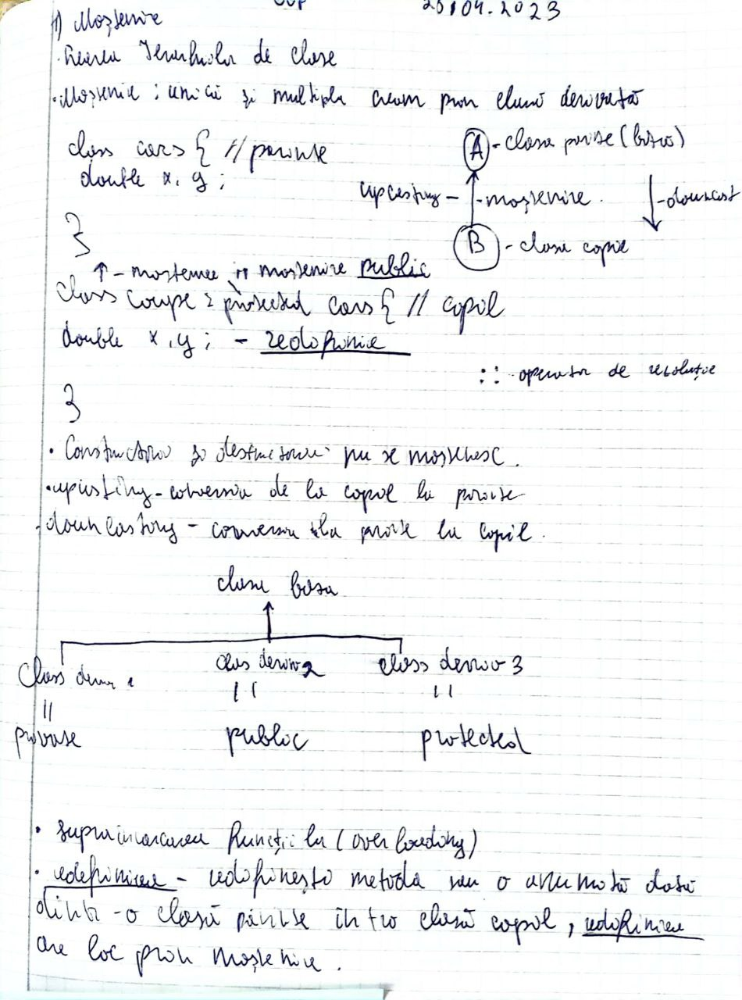

# What is the Inheritance in programming?

Well inheritance is a one of the big princeples of the oop paradigm where the class A(parent class) can have child class B, and every method and date that is applied to the parent class A will be applied also for the class B, class be for example can create another derive object from class A.

## Inheritance code example
```
#include <iostream>

// Clasa de bază
class Vehicle {
public:
    int speed;

    void start() {
        std::cout << "Vehicle started." << std::endl;
    }

    void stop() {
        std::cout << "Vehicle stopped." << std::endl;
    }

    virtual void drive() {
        std::cout << "Vehicle is driving." << std::endl;
    }
};

// Clasa derivată
class Car : public Vehicle {
public:
    int numWheels;

    void honk() {
        std::cout << "Honk honk!" << std::endl;
    }

    virtual void drive() {
        std::cout << "Car is driving." << std::endl;
    }
};

// Clasa derivată din Car
class SportsCar : public Car {
public:
    int topSpeed;

    void drift() {
        std::cout << "Drifting!" << std::endl;
    }

    virtual void drive() { // example of the polimorphism
        std::cout << "Sports car is driving." << std::endl;
    }
};

int main() {
    Car myCar;
    myCar.speed = 60;
    myCar.numWheels = 4;
    myCar.start();
    myCar.honk();
    myCar.drive();
    myCar.stop();

    SportsCar mySportsCar;
    mySportsCar.speed = 120;
    mySportsCar.numWheels = 4;
    mySportsCar.topSpeed = 200;
    mySportsCar.start();
    mySportsCar.honk();
    mySportsCar.drive();
    mySportsCar.drift();
    mySportsCar.stop();

    return 0;
}

```
În acest exemplu, clasa Vehicle este clasa de bază, care conține membri și funcții generice pentru vehicule, inclusiv o funcție virtuală drive(). Clasa Car este clasa derivată, care moștenește membrii și funcțiile clasei de bază Vehicle, dar poate avea și membri și funcții suplimentare specifice mașinilor, cum ar fi numWheels și honk(), și redifinește funcția virtuală drive() pentru a afișa un mesaj specific mașinilor.

Clasa SportsCar este o altă clasă derivată a clasei Car, care adaugă un membru suplimentar topSpeed și o funcție suplimentară drift(), dar redifinește și funcția virtuală drive() pentru a afișa un mesaj specific mașinilor sport.

Pentru a redifini o funcție virtuală, clasa derivată trebuie să declare aceeași funcție virtuală cu același nume și același tip de returnare ca și clasa de bază, iar blocul de definire al funcției în clasa derivată trebuie să conțină instrucțiunile specifice pentru acea clasă.

## Here is some example on the paper


